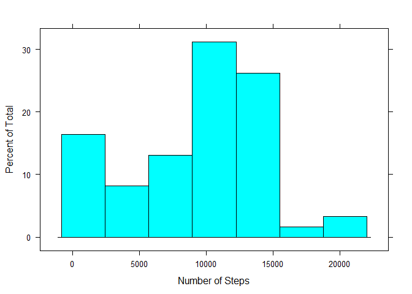
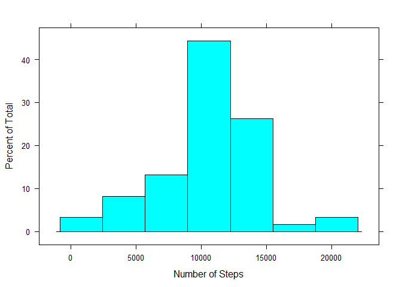
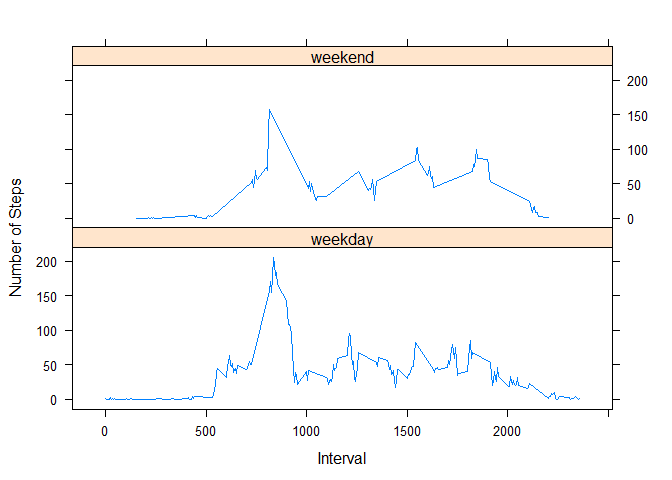

# Reproducible Research: Peer Assessment 1
#### by Dan Jeffrey  

###Setup: 

```r
library(dplyr)
library(lattice)
```
  
  
## Loading and preprocessing the data

```r
unzip("activity.zip")
rawData <- read.csv("activity.csv", colClasses = c("integer","Date","integer"))
str(rawData)
```

```
## 'data.frame':	17568 obs. of  3 variables:
##  $ steps   : int  NA NA NA NA NA NA NA NA NA NA ...
##  $ date    : Date, format: "2012-10-01" "2012-10-01" ...
##  $ interval: int  0 5 10 15 20 25 30 35 40 45 ...
```
  
  
## What is mean total number of steps taken per day?

```r
stepsByDate <- summarize(group_by(rawData, date), steps = sum(steps, na.rm=TRUE))
histogram(stepsByDate$steps, xlab="Number of Steps")
```

<!-- -->

```r
meanStepsPerDay <- mean(stepsByDate$steps, na.rm = TRUE)
medianStepsPerDay <- median(stepsByDate$steps, na.rm = TRUE)
```
The mean number of steps per day is 9,354.23.  
The median steps per day is 10,395.  
  
  
## What is the average daily activity pattern?

```r
stepsByInterval <- summarize(group_by(rawData, interval), 
                            avg=mean(steps, na.rm=TRUE))
with(stepsByInterval, plot(avg~interval, type="l", ylab="Average Number of Steps", xlab="Interval"))
```

<!-- -->

```r
maximumAverageSteps <- stepsByInterval[which.max(as.matrix(stepsByInterval)[,2]),]
```
The maximum number of steps per interval, on average, for all days was 206.1698 in interval 835.  

## Imputing missing values

```r
stepsNA <- is.na(rawData[,1])
nas <- sum(stepsNA)
```
The total number of rows with NA's is 2304.  Note that the Date and Interval fields contained no NA values.

The NA's are replaced with the mean values for the same interval to create a new dataframe with no NA values:

```r
rawWithMean <- merge(rawData, stepsByInterval, by="interval")
filledDataset <- mutate(rawWithMean, steps = ifelse(is.na(steps), avg, steps))
```
  
#### With a "filled" data set: 

```r
stepsByDate <- summarize(group_by(filledDataset, date), steps = sum(steps, na.rm=TRUE))
histogram(stepsByDate$steps, xlab="Number of Steps")
```

<!-- -->
  
Filling the missing values changes the data set significantly. It creates a spread of steps per day that is closer to a normal distribution.  
  

```r
meanStepsPerDay <- mean(stepsByDate$steps, na.rm = TRUE)
medianStepsPerDay <- median(stepsByDate$steps, na.rm = TRUE)
```
The mean number of steps per day is 10,766.19.   
The median steps per day is 10,766.19.  

## Are there differences in activity patterns between weekdays and weekends?
Assign a factor to each row that identifies weekends and weekdays:

```r
filledWithWeekends <- mutate(filledDataset, day=factor(ifelse(weekdays(rawData$date) == "Saturday" | weekdays(rawData$date) == "Sunday", "weekend","weekday")))
str(filledWithWeekends)
```

```
## 'data.frame':	17568 obs. of  5 variables:
##  $ interval: int  0 0 0 0 0 0 0 0 0 0 ...
##  $ steps   : num  1.72 0 0 0 0 ...
##  $ date    : Date, format: "2012-10-01" "2012-11-23" ...
##  $ avg     : num  1.72 1.72 1.72 1.72 1.72 ...
##  $ day     : Factor w/ 2 levels "weekday","weekend": 1 1 1 1 1 1 1 1 1 1 ...
```


```r
stepsByInterval <- summarize(group_by(filledWithWeekends, day, interval), 
                            avg=mean(steps))
xyplot(avg~interval | factor(day), data=filledWithWeekends, pch=19,
       lab="Wt/1,000",  ylab="Number of Steps",layout=c(1,2), xlab="Interval",
       type="l")
```

<!-- -->

#### The End

